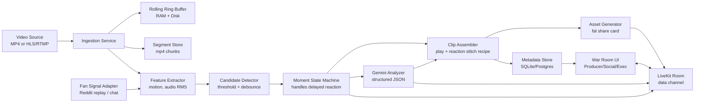

# Vibe Check — Realtime Producer Copilot (Gemini 3 SuperHack)

## 0. Executive summary

**Vibe Check** is a *realtime producer “copilot”* for sports and live entertainment. It watches the stream, listens to the audio, and ingests crowd/fan reaction signals. When something meaningful happens, it:

1) detects a candidate moment quickly (cheap signals),  
2) uses **Gemini 3** for multimodal understanding and structured reasoning,  
3) outputs an *actionable “moment pack”*: clip window(s), explanation, risk/tone guidance, ready-to-post copy variants, and a share card,  
4) pushes it into a **multi-role war room** (producer / social / exec) in realtime.

The key differentiator vs “auto highlights” apps: **this is an operations workflow** (detect → package → approve → ship), and it is built around *reaction latency* and *editorial packaging* (including “reaction-first then play” cuts).

---

## 1. Problem statement

Live sports and live shows are **time-compressed** environments. Teams have seconds, not minutes:

- **Producers** need the moment boundaries and context.
- **Social teams** need copy + assets instantly (and safe tone guidance).
- **Executives/brand leads** need a high-level “should we post?” signal with risk.

The pain: **the response loop is slow and manual** (scrubbing video, understanding what happened, checking sentiment, generating copy, aligning on approval).

### Constraints that shape the system

1) **Realtime**: detection and packaging must happen while the event is still hot.  
2) **Fan reaction delay**: crowd/social reaction often arrives *after* the play (e.g., 10–40 seconds later).  
3) **Packaging matters**: the output is not just “a highlight clip”; it is a *story cut* that fits current short-form formats (often reaction-first).  
4) **Reliability**: a hackathon demo must work without brittle scraping dependencies.

---

## 2. High-level approach (two-stage intelligence)

We split the system into:

### Stage A — Cheap, fast candidate detection (sub-second budget)
Uses lightweight signals to spot “something changed”:
- motion/scene change (frame diffs, shot boundary)
- audio energy spikes (crowd roar, commentator intensity)
- optionally: “fan signal” spikes (Reddit thread activity replay, YouTube chat rate)

This stage decides: **should we spend Gemini tokens here?**

### Stage B — Gemini 3 analysis + packaging (higher quality, gated)
When we have a candidate, we give Gemini a **small, well-chosen multimodal bundle** and ask for a **structured JSON** result:
- what happened, why it matters
- hype score + factors
- risk score + tone guidance
- best clip window(s)
- post copy variants

We then turn that JSON into:
- a highlight clip and/or an Instagram/TikTok-style stitched cut
- a share card image (fal)
- war-room messages (LiveKit data channel)

---

## 3. What Gemini 3 enables (and how we use it)

We lean on Gemini for what it is uniquely good at: **multimodal understanding + structured reasoning + tool-orchestration**.

### 3.1 Video understanding (clip-based, timestamped)
Gemini can take video input and answer questions about content and timestamps. The Gemini API supports:
- uploading larger/longer video via a Files API and reusing a file reference,
- passing smaller video inline,
- using timestamps and clipping intervals, and
- customizing video processing (e.g., clipping, FPS).  
(See “Video understanding” docs for File API vs inline, timestamp references, clipping intervals, and FPS customization.)

**How we use it:**  
We do **not** feed it full games. We feed it short, surgically clipped windows (seconds to tens of seconds), keeping cost and latency bounded.

### 3.2 Structured outputs (strict JSON schema)
Gemini supports **structured outputs via JSON Schema**, which makes the output machine-parseable and reliable for downstream steps.

**How we use it:**  
We define a schema for `MomentAnalysis` and enforce it. This avoids “LLM prose” and makes the pipeline deterministic.

### 3.3 Thinking control (quality vs latency)
Gemini 3 Flash exposes `thinking_level` to trade off reasoning depth vs speed/cost.

**How we use it:**  
- **Gemini 3 Flash** for realtime “moment understanding + packaging”.
- Optionally **Gemini 3 Pro** for deeper post-event summarization or richer story context.

### 3.4 Interactions API (agent-style state + orchestration)
The Gemini Interactions API is a unified interface intended to simplify **state management, tool orchestration, and longer-running tasks** vs raw generate calls.

**How we use it (optional):**  
We can keep a running “show context” interaction (teams, players, performers, running narrative) and feed incremental events into the same interaction, instead of rebuilding context each time.

---

## 4. System architecture

### 4.1 Component diagram



### 4.2 Why LiveKit for the war room
LiveKit is an open source WebRTC stack that supports multi-user rooms where participants publish **audio, video, and data**.  
We use it specifically for the **data channel**: low-latency JSON events that keep all role views in sync.

---

## 5. End-to-end workflow (producer/social/exec)

### Step 0 — Everyone joins the same room
- Producer opens `/producer`
- Social opens `/social`
- Exec opens `/exec`

All three pages join the same LiveKit room and listen for data events.

### Step 1 — Ingestion + buffering
- We ingest video frames and audio samples continuously.
- We maintain a **rolling ring buffer** with enough history for pre-roll capture.

**Ring buffer sizing:**  
Because fan reaction can be delayed, we store at least:
- **pre-roll**: 30–40 seconds before the eventual reaction peak (to include the play context),
- **post-roll**: ~10 seconds after the end of the stitched segment,
- plus slack for late decisions.

### Step 2 — Candidate detection (cheap signals)
Feature extractor computes:
- `motion_score(t)` from frame diffs / shot boundaries
- `audio_rms(t)` from audio amplitude
- `fan_buzz(t)` from Reddit/chat (if enabled)

Candidate detector triggers when:
- a local peak exceeds threshold, or
- a combination exceeds threshold (e.g., moderate motion + strong audio)

It emits `candidate.created` into the LiveKit room.

### Step 3 — Moment state machine (handles delayed reaction)
A single “moment” is **not finalized immediately**. We treat it as a state machine:

- `OPEN`: created at `t0` (the play moment).
- `WAIT_REACTION`: we keep listening for reaction signals for up to ~40 seconds.
- `FINALIZE`: once reaction peak is observed or timeout occurs, we commit a clip recipe.

Why: in many sports formats, *reaction is the strongest indicator* but it arrives later.

### Step 4 — Gemini analysis (structured)
When we have enough context (initial play + early reaction), we call Gemini with:
- keyframes around the play time `t0`
- optionally a short clipped video window
- audio stats (peak level, slope)
- fan snapshot (top comments/keywords and/or buzz rate)

Gemini returns `moment.ready` with strict JSON:
- summary, why, moment_type
- hype/risk scores, risk notes
- recommended clip window(s)
- copy variants

### Step 5 — Clip assembly + “reaction-first then play” stitch
We generate the output video following a recipe (see §6).

### Step 6 — Asset pack delivery + approval
- Exec view sees `hype`, `risk`, and a one-line explanation.  
- Exec clicks **Approve** or **Hold**.
- Social view unlocks the full post pack only on approve.
- Producer view always sees the full details for editing/override.

---

## 6. Handling delayed fan reaction and short-form “stitch” formats

### 6.1 The core idea: decouple *event time* from *reaction time*
Let:
- `t0` = play moment time (detected from video/audio)
- `tr` = reaction peak time (detected from audio/fan buzz), often `t0 + 10s … t0 + 40s`

We want a clip that:
- contains enough **pre-context** to understand the play,
- captures the **reaction** that makes the moment feel big,
- matches short-form narrative pacing.

### 6.2 Clip recipe: “reaction → play → reaction”
A typical recipe:

1) **Reaction lead-in**: `[tr - 2s, tr + 4s]`  
2) **The play**: `[t0 - 6s, t0 + 4s]`  
3) **Reaction button**: `[tr + 4s, tr + 8s]` (optional)

Then concatenate in that order. This matches common Reels/TikTok editing patterns: hook with reaction, then reveal the play, then return to reaction.

### 6.3 How we compute `tr` robustly
Reaction can be approximated from:
- audio RMS peak (crowd roar)
- fan buzz peak (comment rate)
- optionally: commentator prosody (advanced, optional)

We compute a smoothed signal:
`reaction_score(t) = w1*audio_rms_z(t) + w2*fan_buzz_z(t)`

Then:
- `tr = argmax(reaction_score(t))` over `t0 … t0 + 40s` (bounded window)
- if no strong peak, fall back to `tr = t0 + 10s`

### 6.4 Gemini’s role in stitching
Gemini does **not** need to “edit video” directly.
Instead:
- We ask Gemini to propose a *clip recipe* (times + ordering) in JSON.
- We validate and clamp those times to safe bounds.
- We execute the edit with deterministic tooling (ffmpeg/moviepy).

This keeps the pipeline stable while still letting Gemini contribute editorial intelligence.

---

## 7. Video storage: what we store, where, and why

There are two distinct storage problems:

### 7.1 Operational storage (for clipping)
We need to always be able to retrieve frames and audio around `t0` and `tr`.

**Hackathon baseline (simple):**
- Ingestion writes segmented mp4 chunks to local disk:
  - `segments/<stream_id>/<unix_minute>.mp4`
- Ring buffer holds a short history of frames/audio in RAM for immediate access.
- Clip assembler pulls from segments and writes:
  - `clips/<moment_id>.mp4`
- Metadata is stored in SQLite.

**Production-like version:**
- Segment store in object storage (e.g., GCS/S3):
  - time-indexed chunks + lifecycle policy
- Metadata in Postgres + a cache (Redis) for hot moments
- Signed URLs for UI playback

### 7.2 Model input storage (for Gemini)
Gemini offers a Files API for uploading larger/longer videos and reusing references, and inline video for smaller clips.

**How we choose:**
- For short clips, send inline video or a small set of frames.
- For longer clips or reuse across multiple Gemini calls, upload once and reference via file ID.

---

## 8. Tools and libraries (what we use and why)

### Core pipeline
- **ffmpeg**: segmenting streams, cutting windows, concatenation/stitching (battle-tested).
- **OpenCV**: frame sampling, motion score, shot boundary heuristics.
- **numpy/scipy**: audio RMS and signal processing.

### Fan reaction adapters
- **Reddit replay** (recommended for reliability):
  - prefetch comments once, build a time-bucketed comment-rate signal, replay aligned to the clip.
- **Live chat** (optional): YouTube/Twitch chat rate as a realtime buzz signal.

### Sponsor/partner stack (high leverage)
- **Gemini 3**: multimodal understanding + structured outputs + reasoning control.  
- **LiveKit**: multi-user room + realtime data channel for war room.  
- **Pipecat** (optional): realtime voice agent to announce alerts and answer “what happened?”  
- **fal**: generate share card images (fast visual wow).  
- **Browser-use** (optional): fetch context sources (player bio, rivalry context) and attach to moment.  
- **VisionAgents** (optional): incorporate tracking/detection components quickly.  
- **Vercel**: ship the web UI reliably and fast.

---

## 9. Data contracts (schemas)

### 9.1 Candidate event
```json
{
  "type": "candidate.created",
  "candidate_id": "c_001",
  "t0": 523.2,
  "signals": {
    "motion": 0.81,
    "audio_rms": 0.77,
    "fan_buzz": 0.12
  }
}
```

### 9.2 Moment analysis (Gemini structured output)
```json
{
  "type": "moment.ready",
  "moment_id": "m_001",
  "t0": 523.2,
  "tr": 545.8,
  "moment_type": "goal",
  "summary": "…",
  "why_it_matters": ["…","…"],
  "scores": {
    "hype": 87,
    "risk": 22
  },
  "risk_notes": ["…"],
  "clip_recipe": [
    {"label": "reaction_lead", "start_s": 543.8, "end_s": 549.8},
    {"label": "play", "start_s": 517.2, "end_s": 527.2},
    {"label": "reaction_button", "start_s": 549.8, "end_s": 553.8}
  ],
  "post_copy": {
    "hype": "…",
    "neutral": "…",
    "brand_safe": "…"
  }
}
```

### 9.3 Approval events
```json
{ "type": "moment.approved", "moment_id": "m_001", "by": "exec", "at": 560.1 }
```

---

## 10. Demo strategy (what makes it convincing)

A strong demo proves three claims:

1) **We handle delayed reaction**: the system does not miss the play while waiting for reaction.  
2) **We package for short-form**: reaction-first stitch is generated automatically.  
3) **We have an ops workflow**: producer/social/exec views show role-specific information and approvals gate posting.

---

## 11. References (URLs in a code block for portability)

```text
Hackathon page (partners + theme):
- https://cerebralvalley.ai/e/gemini-3-superhack

Gemini API docs:
- Video understanding: https://ai.google.dev/gemini-api/docs/video-understanding
- Structured outputs: https://ai.google.dev/gemini-api/docs/structured-output
- Models: https://ai.google.dev/gemini-api/docs/models
- Interactions API: https://ai.google.dev/gemini-api/docs/interactions

Vertex Gemini 3 Flash docs:
- https://docs.cloud.google.com/vertex-ai/generative-ai/docs/models/gemini/3-flash

LiveKit:
- https://github.com/livekit/livekit
- https://docs.livekit.io/intro/basics/connect/

Pipecat:
- https://github.com/pipecat-ai/pipecat
- https://docs.pipecat.ai/server/frameworks/rtvi/introduction

fal:
- https://fal.ai/
- https://docs.fal.ai/serverless/getting-started/deploy-your-first-image-generator

Browser-use:
- https://github.com/browser-use/browser-use

VisionAgents:
- https://visionagents.ai/
- https://github.com/GetStream/vision-agents
```
